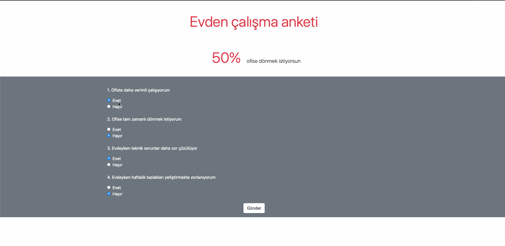

# Evden Çalışma Anketi

Bu proje, evden çalışma ile ilgili bir anket formu içerir. Kullanıcılar, evden çalışmanın ofiste çalışmaya göre avantaj ve dezavantajlarını belirten sorulara cevap verir. Anket sonuçları, kullanıcıların ofise dönme istekliliğini gösterir.



Websitesi  => remoteoroffice.ozkanceyhan.dev

## Kullanılan Teknolojiler

- **HTML**: Sayfa yapısının oluşturulması
- **CSS**: Sayfanın stilinin belirlenmesi
- **JavaScript**: Ankete verilen cevaplara göre sonuçların dinamik olarak hesaplanması ve gösterilmesi
- **Bootstrap**: Sayfanın daha estetik ve kullanıcı dostu hale getirilmesi

## Proje Yapısı

- `index.html`: Anket formunun bulunduğu ana sayfa.
- `script.js`: Anket sonuçlarının hesaplanmasını sağlayan JavaScript dosyası.
- `remote-or-office.gif`: Proje görünümünü gösteren GIF.

## Kurulum ve Kullanım

1. **Depoyu klonlayın:**

   ```bash
   git clone https://github.com/Researcher0619/Remote-or-Office.git
   ```
